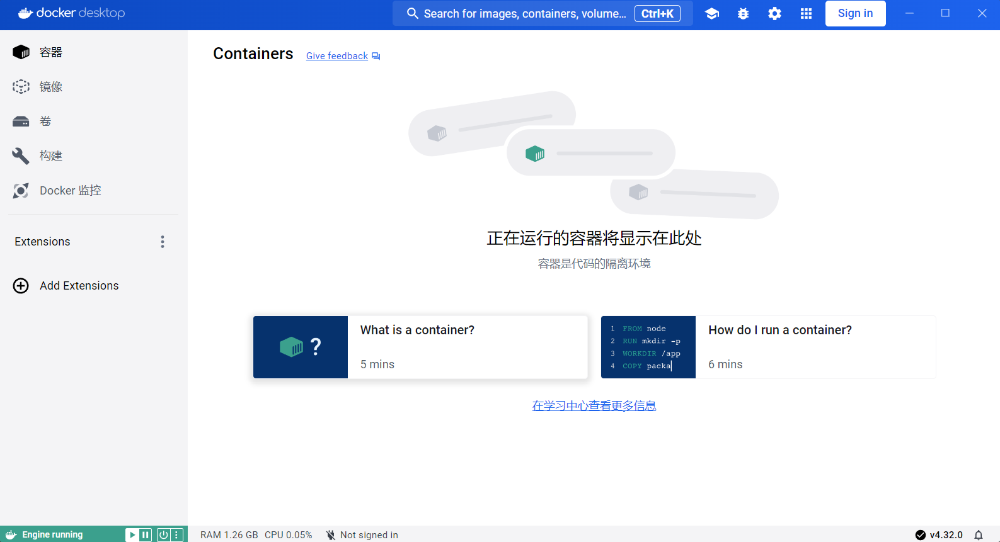
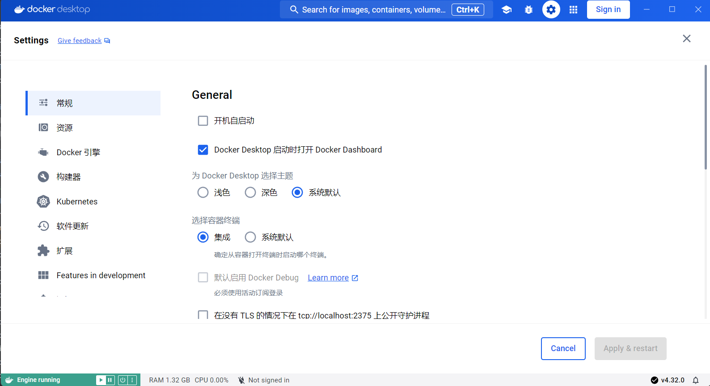
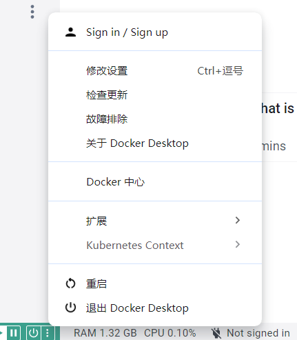
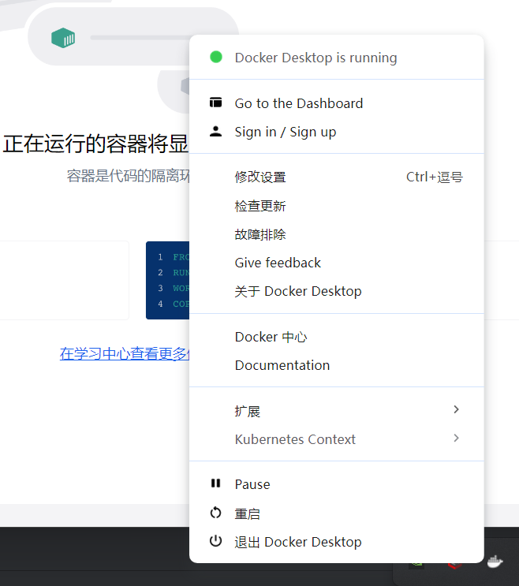

# Docker Desktop汉化包
本仓库提供Docker Desktop 汉化包。

Docker汉化  Docker中文版  Docker Desktop汉化

## 使用方法
1. 关闭Docker Desktop
2. 在Docker安装目录（默认为`C:\Program Files\Docker\Docker\frontend\resources`）找到app.asar文件并将其备份，防止出现意外。
3. 将从本仓库下载的asar文件改名为app.asar后替换原文件

## 最新版本效果图

## 历史更新
2024.7.9 更新4.32版本汉化包

2024.5.12 更新4.29、4.30版本汉化包

2024.3.24 创建本仓库并更新4.28版本汉化包

## Stars
如果你觉得本仓库对你有用的话，请点上一颗star。
