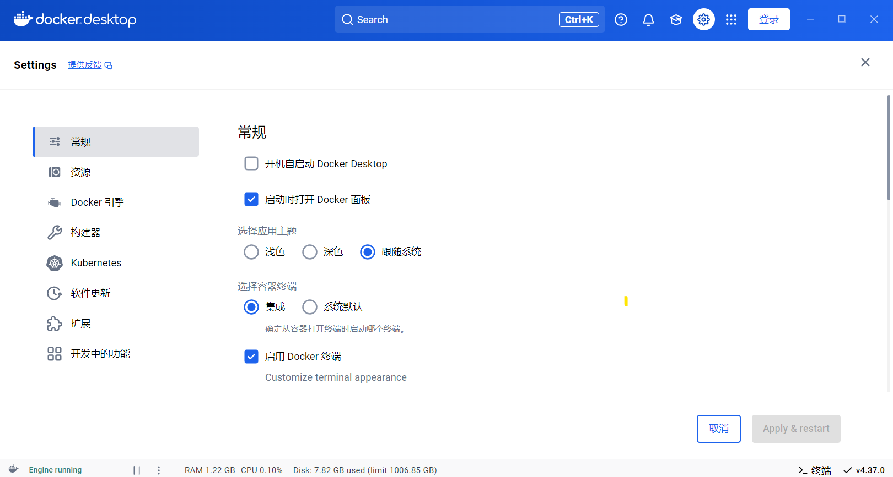
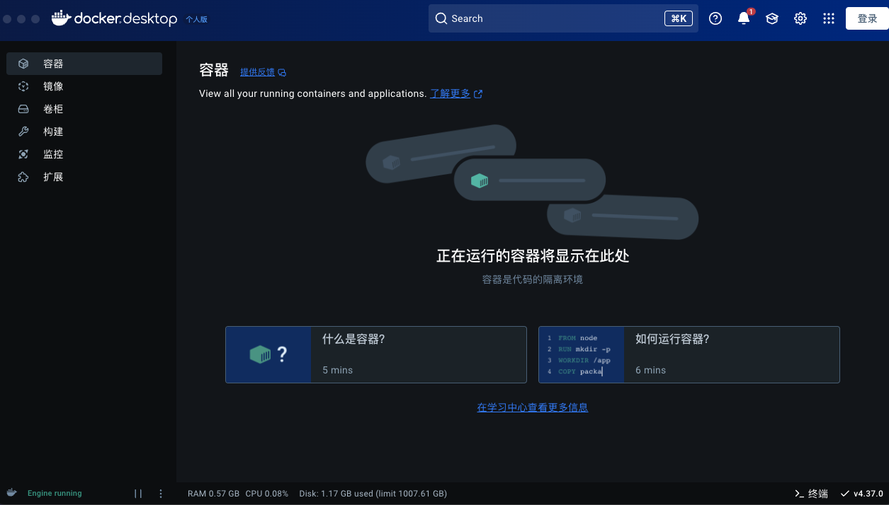
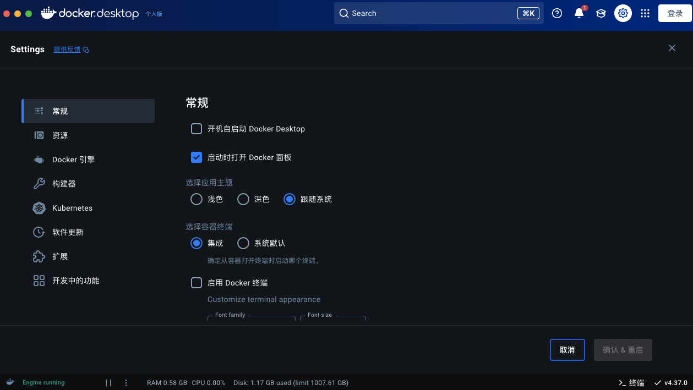
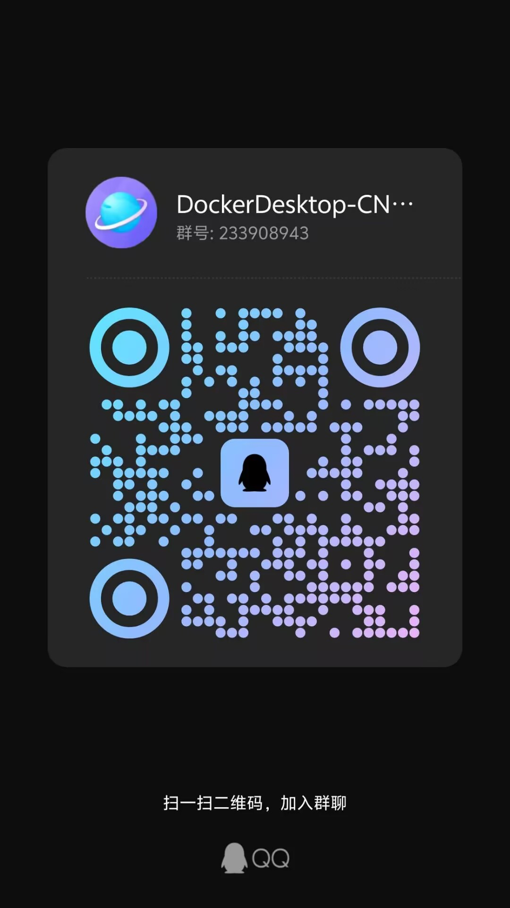

# Docker Desktop汉化包
本仓库提供最新版本Docker Desktop 汉化包。

Docker汉化  Docker中文版  Docker Desktop汉化 Docker Windows Docker MAC

Windows arm 用户只能使用脚本进行汉化。这个架构的汉化包本仓库不予提供。
 

已发布汉化脚本，有需要的自行前往，但请遵守仓库相关许可，否则后果自负。

<big><u>**注意：本仓库仍然会发布各个版本的汉化包！！！**</u></big>

汉化脚本仓库【 https://github.com/asxez/DDCS 】

## 使用方法
1. 关闭Docker Desktop
2. 在Docker安装目录（Windows下默认为`C:\Program Files\Docker\Docker\frontend\resources`，Macos下默认为`/Applications/Docker.app/Contents/MacOS/Docker Desktop.app/Contents/Resources`）找到app.asar文件并将其备份，防止出现意外。
3. 将从本仓库下载的asar文件改名为app.asar后替换原文件

## 最新版本效果图
### Windows

### Mac

## 更多问题？
有问题的可以扫码加群咨询。

## 历史更新
2024.12.17 更新4.37版本汉化包

2024.11.20 更新4.36版本汉化包

2024.10.26 更新4.35版本汉化包

2024.9.3 更新4.34版本汉化包

2024.8.28 更新4.33 MAC版汉化包

2024.8.12 更新4.32 MAC版汉化包

2024.8.10 发布首个汉化脚本版本

2024.8.9 更新4.33版本汉化包

2024.7.9 更新4.32版本汉化包

2024.5.12 更新4.29、4.30版本汉化包

2024.3.24 创建本仓库并更新4.28版本汉化包

## Stars
如果你觉得本仓库对你有用的话，请点上一颗star。
