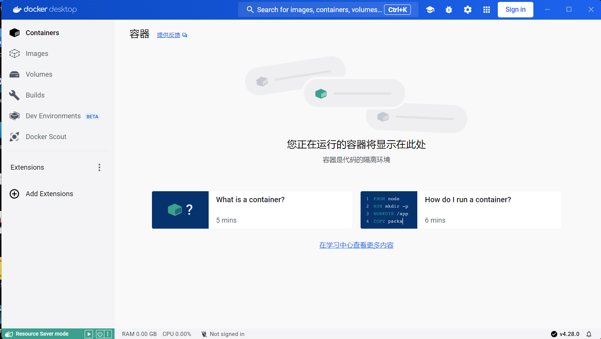
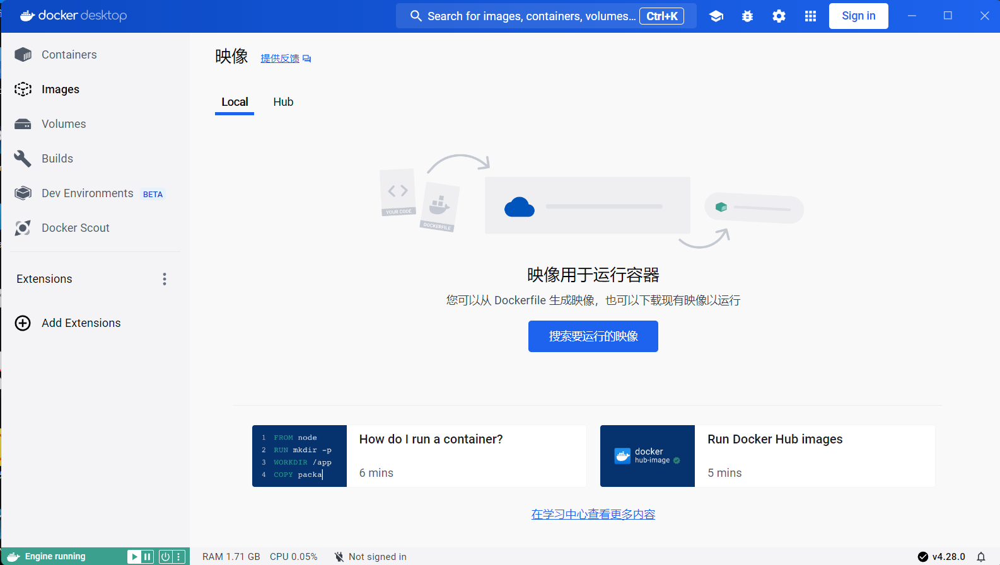
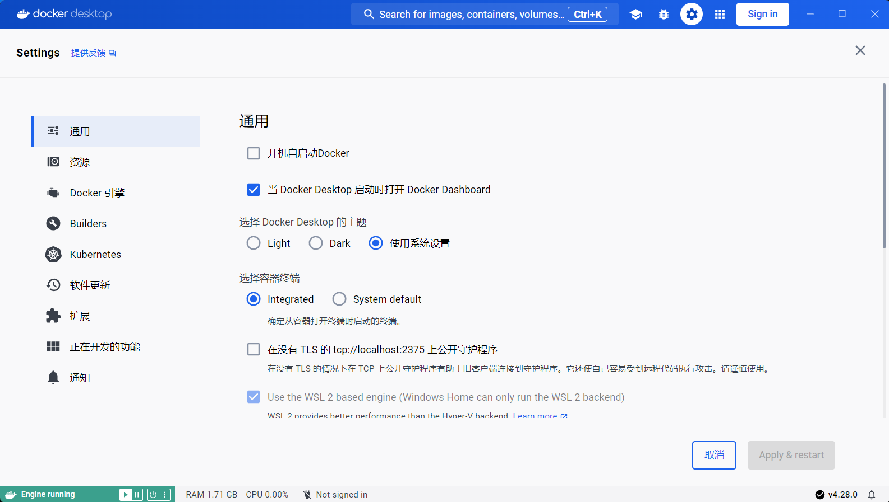

# Docker Desktop汉化包
本仓库提供Docker Desktop 4.28.0版本汉化包。

Docker汉化  Docker中文版  Docker Desktop汉化

由于原英文包过于庞大，汉化过程极其繁杂，因此只汉化了部分界面。

## 使用方法
1. 关闭Docker Desktop
2. 在Docker安装目录（默认为`C:\Program Files\Docker\Docker\frontend\resources`）找到app.asar文件并将其备份，防止出现意外。
3. 将从本仓库下载的app.asar文件替换原文件

## 效果图

## Stars
如果你觉得本仓库对你有用的话，请点上一颗star。
